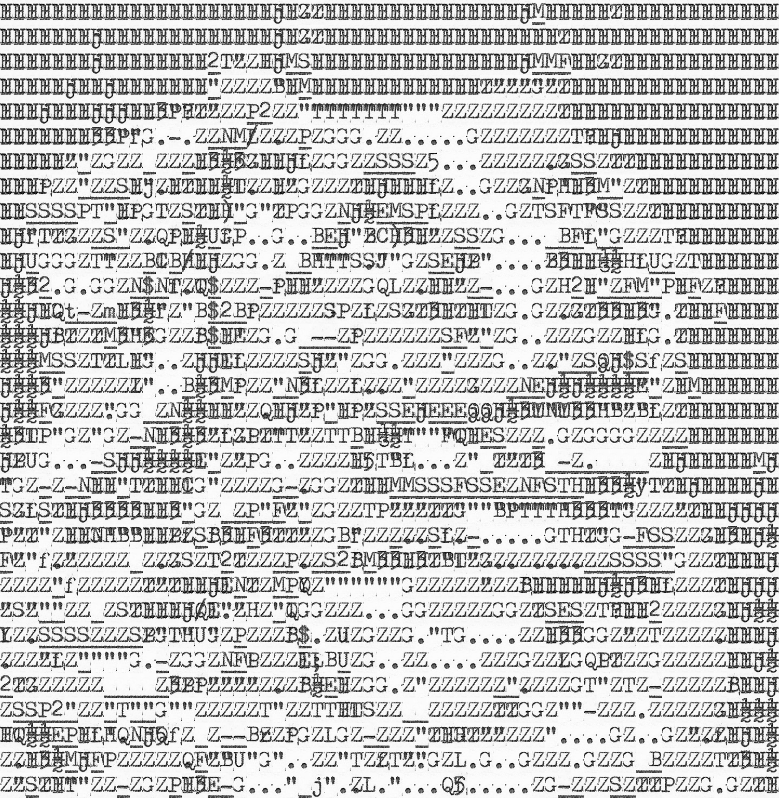

Typo_graphics
=============

Typo_graphics is a small, pure python project focussing on making images with a typewriter.

Similar to ASCII art, images are created, but with a heavy focus on utilising character shapes for best effect, and utilising the unique functionality of the typewriter to type letters on top of each other.

[Documentation](https://richyshub.github.io/Typo_graphics)



---

Features
--------
- Typewriter agnostic, use any monospaced typeface.
- Optimised instruction output, making it as easy as possible to type your final image.
- [Heavily documented](https://richyshub.github.io/Typo_graphics) both in terms of function, and development.
- Built from first principles to make the best images from a typewriter.

---

How do I get started?
---------------------
[The Tutorial](https://richyshub.github.io/Typo_graphics) is the best place to get to grips with using Typo_graphics, and to go from input image to seeing your first typed art in as few as 6 lines.

```
from PIL import Image
from typo_graphics import Typograph

typograph = Typograph()
target_image = Image.open('dog.png')
result = typograph.image_to_text(target_image)

result.output.show()
```
---

License
-------
Typo_graphics was created by Richard Spencer (RichysHub), and is provided for personal use only, in accordance to [the license](./license.txt).
