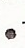
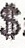
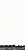
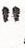

Concepts
========

.. currentmodule:: typo_graphics

This section contains some more in depth detail about the decisions involved in creating Typo_graphics,
as well as some of the logic that built the foundations for some of the methods.
This section will feature some mathematical rigour, where deemed necessary.

Glyphs
------

Typewriters are, for the most part, monospace writing machines.
As such they are only able of placing ink within a bounding box, the space of one glyph.

Anything that can be typed, either with a single keypress, or by holding a modifier key such as Shift, is referred to as a glyph.
Glyphs produced in this way are referred to as typeable. Typeable glyphs are what one would think of as a character on a typewriter.

In addition to typeable glyphs, Typo_graphics considers composite glyphs. These are glyphs created by overtyping one glyph upon another.
Typo_graphics considers only the problem of composing monospace glyphs, not duospace or variable width characters.

Samples
-------

When considering the shape of a glyph, there is a certain amount of detail that can be ignored.
When a glyph is created, a second image is made, scaled down. It is this image that is used internally for matching to the image.

To what level this image is scaled down can affect the results obtained. By default, glyphs are scaled to an image 3 pixels by 3 pixels.
Higher samples tend to take longer to process, but give more accurate results.
Lower samples are much quicker, but will focus less on glyph shape, and more on average brightness of the glyph as a whole.

With samples of (3, 3), each pixel will be an average value of that ninth of the input glyph image.
This allows for concepts such as how bright the center ninth of the pixel is, which will be used when matching.

This sample sized version of a glyphs image can be accessed with :attr:`Glyph.fingerprint`.
An additional version of this image, scaled back up to the original glyph size is also created, :attr:`Glyph.fingerprint_display`.

Chunking
--------

In order to match glyphs, we must first split our image up into glyph size chunks.
This is the action of :meth:`Typograph._chunk`, which takes the input image and renders regions of pixels,
equal to the sample size of the glyphs.

Each chunk of the image is treated entirely independently.
This approach therefore does pose problems in extending the program to duospace fonts, or for half line spacing.
In both of these cases, the chunks would have interdependency.

Glyph matching
--------------

Matching glyphs to parts of images is a nontrivial task.
From chunking we have produced pixel chunks, corresponding to sample shaped regions of the input image.
By default these will contain 9 values, ranging from 0 to 255.

If we ignore the combination glyphs, the SR100 typewriter offers 82 typeable glyphs.
While this may seem a lot, it pales in comparison to the 256^9 = 4,722,366,482,869,645,213,696 possible 9 pixel chunks.

The matching problem, it was found, can be viewed as analogous to the nearest neighbour problem,
and therefore tackled with known approaches.

Nearest neighbour
^^^^^^^^^^^^^^^^^

How does matching a glyph to a set of pixels become a nearest neighbour problem?

First let us consider the simplest case, where samples is (1, 1).
In this case, nothing about glyph shape matters, all that goes into the calculation is the average luminosity value.
This average value is effectively a brightness score, a position on the scale from 0 to 255,
where 0 would be an entirely black glyph, and 255, an entirely white one.

Very empty characters, like the full stop would have a very high value.

    The full stop, a very empty character.

Whereas very full characters, like the dollar sign, are much heavier with ink.

    The dollar sign, a very heavy character.

Analysing all the glyphs in the SR100 set, we could form a scale from 0 to 255.
Whenever we want to match a pixel of the image, we would look for the glyph closest to the average value of said pixel.
That glyph would be our closest match, and would be used for that region of the image.

Extending this, consider the case in which it is (1, 2), that is to say, 1 sample across and 2 down.
In this case, our fingerprint images now give the concepts of upper half value, and lower half value.

    The underscore, a very bottom heavy character.

Characters that are very bottom heavy, such as the underscore will have be dark in the lower half, and near white in the upper.
The reverse of this would be true of upper heavy characters such as quotation marks.

    The quotation mark, a very top heavy character.

To match a glyph now, however, we have to consider the value of both halves, in conjunction.
To visualise, we imagine that the typeable glyphs exist on a 2d plane,
with the x axis being the lower half value, and the y axis the upper half value.

Our image chunk is now a point in this 2D space, and we can use euclidean distance to find how far it is from every glyph.
In doing so, we can pick the shortest 'distance', which is our closest glyph.

Calculating the distance to every glyph, however, is very costly.
This is an example of the nearest neighbour problem in two dimensions.
Much more optimal approaches exist, such as the k-d tree that Typo_graphics utilises.

As samples increases, so does the dimensionality of the nearest neighbour search.
At (3, 3), we are using 9 dimensional space.
The specific implementation of k-d tree, :class:`~scipy.spatial.cKDTree` openly admits its searches are not much more
efficient than brute force for high numbers of dimensions. The value of high in this context is >20,
so it is advised that this is kept in mind when raising samples. This is an open problem.

Close enough matching
^^^^^^^^^^^^^^^^^^^^^

When we include the combination glyphs that Typo_graphics uses, by default stacking to a depth of 2,
often the best match is a 2-glyph stack. This would be expected just based on the number of each type,
there is an order of magnitude more combination glyphs.

However, typing a combination glyph is usually more work than typing a single glyph.
The exact handling of this is imprecise, it does not include considerations of having to press the shift key,
or perhaps having to switch to a specific mode on an electronic typewriter.
It also assumes that advancing the carriage one space (normally just pressing the spacebar) is not an expensive action.

What we can say, is that typing 2 glyphs is harder than 1.
The most labour intensive way would be to type one glyph, backspace, and overtype another.
We know, that to type two glyphs, will be at least as difficult as to type one glyph, then another.

Assuming the backspace is just like any other key,
the effort to type a 2-glyph stack is thus: :math:`2 E_1 \leq E_2 \leq 3 E_1`.
Where :math:`E_1` is the effort to type a single glyph, and :math:`E_2` that of a 2-glyph stack.
We will claim that :math:`E_2` will be equal to :math:`E_1`, plus some 'extra effort', :math:`\varepsilon`.

We would only have elected to use the 2-glyph stack in the first place,
if it were closer to the pixel chunk in the n-dimensional neighbour search space.
As such, the value of :math:`d_1 - d_2` is known to be positive,
if :math:`d_n` is the distance from the pixel chunk to the stack of :math:`n` glyphs.

In order to get a sense of scale for this :math:`d_1 - d_2`, let us introduce :math:`\bar{d}`.
This :math:`\bar{d}` is the distance from our pixel chunk to a glyph, on average.
We will ignore the specifics on how we calculate :math:`\bar{d}` for now.

We can say that if :math:`\dfrac{d_1 - d_2}{\bar{d}}` is small enough, the single stack is close enough,
and it is easier to substitute the 2-glyph stack with it.
Also, if it is a lot of extra effort to type the 2-glyph stack, we would accept a less close match.

The proposed form is then,

.. math::

    \frac{d_1 - d_2}{\varepsilon \bar{d}} < c

Where :math:`c` is some tunable cutoff value.

To generalise, to compare two stacks of :math:`a`, and :math:`b` glyphs, where :math:`a > b`,

.. math::

    \frac{d_b - d_a}{\varepsilon (a - b) \bar{d}} < c

We can then combine the :math:`\varepsilon` and :math:`c` parameters into a single cutoff value,

.. math::

    \frac{d_b - d_a}{(a - b) \bar{d}} < \mathit{cutoff}

This cutoff value is directly implemented as the keyword parameter `cutoff` for :meth:`~Typograph.image_to_text`.
The default value is 0, which will disable this 'close-enough' evaluation.
A value of 1 would result in only single glyphs being used.

Centroid calculation
^^^^^^^^^^^^^^^^^^^^

Calculating :math:`\bar{d}`, the distance of our chunk to a glyph, on average, if done naively, is a very costly procedure.
For each chunk, of which we expect on the order of several thousand,
we would have to calculate distances in 9 dimensional space to thousands of glyphs.

In order to tackle this hefty workload in a smarter way, we employ use of a centroid.
Upon creation of each :class:`~typo_graphics.typograph.tree_set`, the centroid of the glyphs in that collection is calculated.
The centroid is defined as the average position in sample parameter space, so by default it will be a 9 dimensional point.

:math:`\bar{d}` is the Root Mean Square Distance (RMSD) to glyphs in the collection.
To manually calculate this would be to calculate all distance squares, take a mean, and then square root.
As stated before, this would be incredibly costly.

We can introduce the centroid :math:`m`, to alleviate this issue.

.. math::

    \text{RMSD} &= \sqrt{\frac{1}{N}\sum_{i=1}^N (x_i - p)^2}

    (x_i - p)^2 &= (x_i - m + m - p)^2

                &= (x_i - m)^2 + (m - p)^2 + 2(x_i - m)(m - p)

Where :math:`x_i` denote glyph positions, and :math:`p` our chunk point in the sample space.
However, we know that :math:`(m - p)` is constant,

.. math::

    N (\text{RMSD})^2 &= \sum_{i=1}^N (x_i - p)^2

                      &= N(m-p)^2 + \sum_{i=1}^N \{(x_i - m)^2 + 2(x_i - m)(m - p)\}

                      &= N(m-p)^2 + \sum_{i=1}^N (x_i - m)^2 + 2(m-p)\sum_{i=1}^N (x_i - m)

But, by definition of the centroid, the second summation vanishes,

.. math::

    \text{RMSD} = \sqrt{(m-p)^2 + \frac{1}{N}\sum_{i=1}^N (x_i - m)^2}

The second term inside the square root is simply the mean square distance from centroid,
which is a constant over the :class:`~typo_graphics.typograph.tree_set`, and can also be calculated at creation time.

This derivation allows us to calculate :math:`\bar{d}`, needing only to calculate its distance from one point, the centroid.
This approach is used in :meth:`~Typograph._root_mean_square_distance`, used by :meth:`~Typograph._find_closest_glyph`.

Instruction format
------------------

The instruction format, as is mentioned in :ref:`the inspiration section <instruction_format>`,
is heavily inspired by the Neill format. This format is very logical, but its creation presented some interesting problems.
The main problem is how to organise the glyph instructions for 2 overtyped lines,
creating the most concise set of instructions.

Sorting instructions
^^^^^^^^^^^^^^^^^^^^

In this section, I will introduce a new notation for composite glyphs.
Letters stacked vertically between brackets indicate a single glyph composed of those typeable glyphs.

In this format, the exclamation mark we composed from an apostrophe and a full stop would be shown with two stacked glyphs.
To underscore it, we would also add the underscore to the stack:

.. math::

    \text{!} = \TwoGlyph{'}{.}

In general, I will use capital letters, though the logic is not dependent on the specif glyph components.
Occasionally I will align glyph stacks of uneven length. In this situation, the instructions should have a spacer inserted.
In fact, the spacer glyph used in these situations can be passed as the keyword argument `instruction_spacer` to :meth:`~Typograph.image_to_text`.
The default for this is a spacebar glyph, which has the :attr:`~Glyph.name` sp.

We have a line of composite glyphs. If these are all 2-glyph stacks, we have to create 2 instruction lines,
so that the user can type one, return the carriage, and type the other.

The most basic approach would just to use the first character in the components for the first line,
and the 2nd component for the second line. Note that the components are stored sorted.
This is the 'sorted' approach.

.. note::

    When comparing approaches, we are most interested in the total number of instructions produced,
    each instruction being how many to type, and what character to type, ie :math:`2A`.

Sorted
""""""

The sorted method would produce the following:

.. math::

    \ThreeGlyph{A}{B}{C} \uTwoGlyph{A}{B} \Rightarrow \begin{matrix} 2A \\ 2B \\ 1C \end{matrix}

The lowest line of the instructions here could have a :math:`sp` appended for the trailing spacer, but these are omitted.
When typing, if the remainder of the line is spaces, we may as well return the carriage and begin typing the next line.

This appears to work reasonably well, but it is not difficult to find a counter case that shows this is not sufficient:

.. math::

    \ThreeGlyph{A}{B}{C} \uTwoGlyph{B}{C}
    &\Rightarrow \begin{matrix} 1A & 1B \\ 1B & 1C \\ 1C & \end{matrix}

    &\nRightarrow \begin{matrix} 1A \\ 2B \\ 2C \end{matrix}

Hopefully you agree the second option there would be much simpler to type than the first, you need switch characters less often.
The first instruction set contains 5 instructions, compared to the second set which contains just 3.
Clearly a different algorithm is needed.

.. _currently_using:

Currently using
"""""""""""""""

Perhaps it is sufficient to make passes down the line, taking the first typeable glyph,
and only switching to a new one when it is not available in a composite?
This works of the following, which sorted fails to cover.

.. math::

    \uTwoGlyph{C}{D} \ThreeGlyph{A}{B}{C}
    \Rightarrow \begin{matrix} 2C \\ 1D & 1A \\ 1sp & 1B \end{matrix}

However, this fails on the same case we saw sorted fail,

.. math::

    \ThreeGlyph{A}{B}{C} \uTwoGlyph{B}{C}
    &\Rightarrow \begin{matrix} 1A & 1B \\ 1B & 1C \\ 1C \end{matrix}

    &\nRightarrow \begin{matrix} 1A \\ 2B \\ 2C \end{matrix}

Most common
"""""""""""

We are aiming to make chains of characters, so perhaps it is best to focus on the most common glyphs, propose:

* Work out amount of each glyph total in composites.
* Pick the most common we've yet to use, and process that through.
* Any that do not have the current most common, use the least common one from the available components.

This successfully works solves this problem, which none of the previous manage:

.. math::

    \ThreeGlyph{A}{B}{C} \uTwoGlyph{B}{C} \uOneGlyph{C}
    \Rightarrow \begin{matrix} 3C \\ 2B \\ 1A \end{matrix}

But, once again, a counterexample can be found. I am unsure if an easier counterexample exists,

.. math::

    \ThreeGlyph{A}{C}{D} \uTwoGlyph{A}{B} \uOneGlyph{B} \uTwoGlyph{A}{B} \ThreeGlyph{A}{C}{D}
    &\Rightarrow \begin{matrix} 2A & 1B & 2A \\ 1C & 1B & 1sp & 1B & 1C \\ 1D & 3sp & 1D \end{matrix}

    &\nRightarrow \begin{matrix} 2A & 1sp & 2A \\ 1C & 3B & 1C \\ 1D & 3sp & 1D \end{matrix}

Here the saving looks small, but this is just 4 composite glyphs. When lines grow to 60 characters, it may well become an issue.
It looks like this method, with modification might be viable, but keeping track of the list of most common glyphs seems a lot of busywork.

Left comparison
"""""""""""""""

This is the method that was finally decided upon, it is implemented as the instruction composer in :meth:`~Typograph._instructions`.

The left comparison is a modified version of the :ref:`currently using <currently_using>` method we covered earlier.
The main extra consideration we need to add is that we want to consciously place glyphs to extend any current runs we can.
This method's description will be far more in depth, as it is backed by the rigours of implementation.

Let us work through processing the following:

.. math::

    \ThreeGlyph{B}{C}{D} \ThreeGlyph{A}{B}{D} \uOneGlyph{A}

The first composite glyph is accepted as is, its arrangement is inconsequential.

.. math::

    \ThreeGlyph{B}{C}{D}

We now want to place the glyph :math:`\ThreeGlyph{A}{B}{D}`.
We know our glyph will contain 3 positions, so let us create a glyph made of spacers,
and keep track of the indexes we have available.

.. math::

    \ThreeGlyph{B}{C}{D} \ThreeGlyph{sp}{sp}{sp} \quad
    \mathit{indexes} = \begin{pmatrix} 1 \\ 2 \\ 3 \end{pmatrix}

We work through it in order.
Is :math:`A` in our previous glyph? No? Then let us set it aside in a deferred list.

.. math::

    \ThreeGlyph{B}{C}{D} \ThreeGlyph{sp}{sp}{sp} \quad
    \mathit{indexes} = \begin{pmatrix} 1 \\ 2 \\ 3 \end{pmatrix} \quad
    \mathit{deferred} = [ A ]

Next, is :math:`B` in our previous glyph? Yes! Place it in the correct position in our new glyph,
and mark its index as no longer available.

.. math::

    \ThreeGlyph{B}{C}{D} \ThreeGlyph{B}{sp}{sp} \quad
    \mathit{indexes} = \begin{pmatrix} 2 \\ 3 \end{pmatrix} \quad
    \mathit{deferred} = [ A ]

Is :math:`D` in our previous glyph? Yes, so repeat as above.

.. math::

    \ThreeGlyph{B}{C}{D} \ThreeGlyph{B}{sp}{D} \quad
    \mathit{indexes} = \begin{pmatrix} 2 \end{pmatrix} \quad
    \mathit{deferred} = [ A ]

We have reached the end of the components that we need to place.
We are now sure that any runs that were being made before, are being continued if possible.
Now we can fill in the gaps, using the deferred list.
In this, we work through the available indexes in order.
This has the side effect of making the last instruction line the most likely to contain spaces.
In practice this is helpful, as overtyped lines are harder to check when typing.

.. math::

    \ThreeGlyph{B}{C}{D} \ThreeGlyph{B}{A}{D}

The next composite glyph we need to place is :math:`\OneGlyph{A}`.
This only has one components, but the last one had 3, so we will use three as well.
In general, the number of component indexes we allow will be equal or more than is used on the line already.

.. math::

    \ThreeGlyph{B}{C}{D} \ThreeGlyph{B}{A}{D} \ThreeGlyph{sp}{sp}{sp} \quad
    \mathit{indexes} = \begin{pmatrix} 1 \\ 2 \\ 3 \end{pmatrix}

Is :math:`A` in the glyph before? Yes, place it in the correct location, and remove the index.

.. math::

    \ThreeGlyph{B}{C}{D} \ThreeGlyph{B}{A}{D} \ThreeGlyph{sp}{A}{sp} \quad
    \mathit{indexes} = \begin{pmatrix} 1 \\ 3 \end{pmatrix}

We have reached the end of our components, fill in any deferred glyphs, of which we have none, and we are done.
Pre-filling with the spacer avoids us having to look for and fill in any holes at this stage.

.. math::

    \ThreeGlyph{B}{C}{D} \ThreeGlyph{B}{A}{D} \ThreeGlyph{sp}{A}{sp}
    \Rightarrow
    \begin{matrix} 2B \\ 1C & 2A \\ 2D \end{matrix}

The line has finished, these are our instruction lines.
A line number and letter would be added, and these would be added to the full instructions.

I believe that this left comparison method successfully minimises the number of instructions,
and does so in a relatively efficient manner.
One optimisation I have not made is to balance the number of instructions per line.
Nor have I considered that glyphs already seen in the line, are easier to find again, especially on an unfamiliar keyboard.

Consider the following:

.. math::

    \TwoGlyph{A}{C} \TwoGlyph{B}{C} \TwoGlyph{A}{D} \TwoGlyph{B}{D}
    \Rightarrow \begin{matrix} 1A & 1B & 1A & 1B \\ 2C & 2D \end{matrix}

Here the :math:`A` s and :math:`B` s are kept to one line, but perhaps the following would look nicer, having the lines balanced:

.. math::

    \begin{matrix} 1A & 1B & 2D \\ 2C & 1A & 1B \end{matrix}

It is hard to know which of these is clearer, I would be interested to hear opinions on this post-processing of instructions.