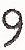

Getting started
===============

.. currentmodule:: typo_graphics

Using the Typograph class
-------------------------

The primary class of Typo_graphics is the :class:`Typograph` class.
The :class:`Typograph` object encapsulates all the processing of glyphs need to transform an image.
If we want to convert several images with the same settings, we need only creates one
:class:`Typograph` object, which avoids repeat processing calculations.

Simple Typograph creation
^^^^^^^^^^^^^^^^^^^^^^^^^

The simplest way to create an instance is without any arguments passed:

.. code-block:: python

    from typo_graphics import Typograph
    typograph = Typograph()

This :class:`Typograph` object will use the default glyphs,
you can examine the glyphs by their names:

.. code-block:: python

    typograph.glyphs['9'].show()

    Glyph image for the character ``9``.

The :attr:`~Typograph.glyphs` dictionary will contain all 82 of the glyphs typeable with the SR100 typewriter.
By default, :attr:`~Typograph.glyph_depth` will be 2,
meaning that `typograph` will have constructed and stored all 2-glyph combinations.

Convert image to glyphs
^^^^^^^^^^^^^^^^^^^^^^^

To convert an image into glyph form, we need only pass a PIL :class:`~PIL.Image.Image` object
to the :meth:`~Typograph.image_to_text` method, as follows:

.. code-block:: python

    from PIL import Image

    target_image = Image.open('dog.png')
    result = typograph.image_to_text(target_image)

This `result`, which will be a :class:`~typo_graphics.typograph.typed_art` object contains our output.
From this object we can extract the instructions, output image,
and even peer into the workings of the code by looking at the calculation image.

.. code-block:: python

    print(result.instructions)

.. code-block:: python

    result.output.show()

.. code-block:: python

    result.calculation.show()

Using Transparency
^^^^^^^^^^^^^^^^^^

By default, :class:`Typograph` will ignore transparency in images,
and therefore may reproduce detail in unexpected regions.

:meth:`Typograph.image_to_text` accepts the keyword argument `background_glyph`,
which if not ``None`` will enable transparency.

If a :class:`Glyph` object is passed to `background_glyph`, it will be tiled in any region deemed transparent.
In the borders of the transparency, where the image is neither fully opaque, nor fully transparent,
the background glyph is merged into the image.

The following creates a :class:`Typograph` object, and uses it to convert a transparent image:

.. code-block:: python

    from PIL import Image
    from typo_graphics import Typograph

    typograph = Typograph()
    plus = typograph.glyphs['+']

    target_image = Image.open('transparent.png')
    result = typograph.image_to_text(target_image, background_glyph=plus)

Here the image is now overlaid atop a grid of + characters.

It should be noted that `background_glyph` is treated separately from other glyphs,
and so will not be used in opaque regions of the image, unless also present in :attr:`~Typograph.glyphs`.

Using a different set of glyphs
^^^^^^^^^^^^^^^^^^^^^^^^^^^^^^^

passed directly
^^^^^^^^^^^^^^^

glyph sheet
^^^^^^^^^^^

directory
^^^^^^^^^

Adding glyphs
^^^^^^^^^^^^^

Removing glyphs
^^^^^^^^^^^^^^^

standalone glyphs
^^^^^^^^^^^^^^^^^

What is samples for?
^^^^^^^^^^^^^^^^^^^^

glyph depth
^^^^^^^^^^^

sizing
^^^^^^

cutoff
^^^^^^

resize mode
^^^^^^^^^^^

clip limit
^^^^^^^^^^

rescale intensity
^^^^^^^^^^^^^^^^^

enhance contrast
^^^^^^^^^^^^^^^^

instruction spacer
^^^^^^^^^^^^^^^^^^
